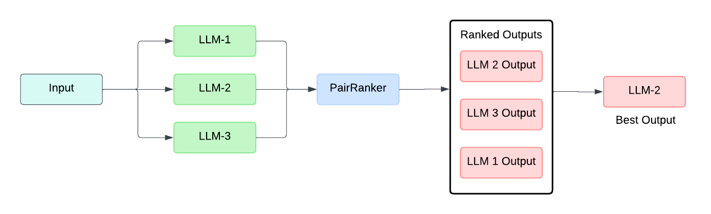
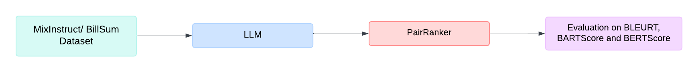

# LLM-Blender

**Paper:** [LLM Ensembling: Haystack Pipelines with LLM-Blender](paper/llm_blender.pdf)

- LLM-Blender is an ensembling framework designed to achieve consistently superior performance by combining the outputs of multiple language models (LLMs). This work focuses on integrating LLM-Blender with Retrieval-Augmented Generation (RAG) pipelines to significantly improve the quality of generated text.

- LLM-Blender is a two-stage ensemble learning framework. In the first stage (ranking), pairwise comparison of candidates is performed, and they are then ranked. In the second stage (fusing), the top K candidates are merged to render the final output.

- The LLM-Blender comprises of two modules: the PairRanker and the GenFuser. The PairRanker module compares the outputs from multiple LLMs to provide the top-ranked outputs. It compares each candidate with the input in a pairwise manner, making it robust to subtle differences in the generated text. The GenFuser module uses the top-ranked outputs from the PairRanker module to generate an improved output. The module fuses the top K of the N-ranked candidates from the PairRanker, conditioned on the input instruction, to generate an enhanced output.

- A custom Haystack component, `LLMBlenderRanker`, has been implemented to integrate LLM-Blender with Haystack pipelines. The component utilizes the `PairRanker` module from the LLM-Blender framework, which compares each candidate with the input in a pairwise manner. Different LLMs can generate subtly different texts, since they are trained on different datasets and tasks. By comparing each text in a pairwise manner, the component ranks and ensembles the text so it is robust to these subtle differences.

- Haystack RAG Pipelines with the LLM-Blender component to ensemble LLMs were evaluated. The pipelines were evaluated on the BillSum and MixInstruct datasets using three metrics: BARTScore, BLEURT, and BERTScore. The `llama-3`, `phi-3`, `mistral-7b`, `openchat-3.5`, `starling-lm-7b-alpha` and `openhermes-2.5` LLMs were used in the ensemble.

## PairRanker

- The PairRanker module is responsible for comparing and ranking the outputs from LLM's. During the ranking stage, a specific input prompt (x) is passed to N different LLMs, and their outputs are compiled as candidates ($y_1$, …, $y_N$).

- The PairRanker then analyzes and ranks these candidates. For each input x, the candidates are obtained from N different LLMs. This input sequence, along with the candidates, is then subjected to a cross-attention text encoder, such as RoBERTa. The text encoder is tasked with learning and determining the superior candidate for the given input x.

- All the candidates are paired ($y_i$ and $y_j$), producing a matrix of pairwise comparison results. These pairs are evaluated based on the condition: given the input prompt, which candidate's output is better? By aggregating the results in the matrix, the PairRanker can rank all candidates and take the top K of them for generative fusion.



## GenFuser

- The primary goal of the GenFuser module is to capitalize on the strengths of the top K selected candidates from the PairRanker's ranking.

- After the PairRanker module ranks the candidates, the GenFuser module is employed to fuse the top K out of the N ranked candidates and generate an improved final output. It takes a seq2seq approach, fusing the set of top candidates while conditioning on the input prompt, to generate an improved and enhanced output.

## RAG Pipeline with the LLM Blender component

The results from the different LLMs on the MixInstruct dataset are ranked and combined using the LLM-Blender framework.

<br>


## Usage

To run the pipelines, you will need to clone this repository and install the required libraries.
Install the llm-blender package:

```bash
git clone https://github.com/avnlp/llm_blender
cd llm_blender
pip install -e .
```

## LLM-Blender using Mistral, LLama-3 and Phi-3 models on the MixInstruct Dataset

``` python
cd src/llm_blender/mix_instruct/
python llm_blender_ranker_all_llms.py
```

## LLMBlenderRanker Component Usage

```python
llm_ranker = LLMBlenderRanker(model="llm-blender/PairRM")
answers = [
    GeneratedAnswer(data="Paris is the capital of France.", query="What makes Paris unique?", documents=[]),
    GeneratedAnswer(
        data="The Eiffel Tower is an iconic landmark in Paris.", query="What makes Paris unique?", documents=[]
    ),
    GeneratedAnswer(data="Berlin is a beautiful city.", query="What makes Paris unique?", documents=[]),
]
output = llm_ranker.run(answers=answers)
ranked_answers = output["answers"]
print(ranked_answers)

# [
#     GeneratedAnswer(
#         data="The Eiffel Tower is an iconic landmark in Paris.",
#         query="What makes Paris unique?",
#         documents=[],
#         meta={},
#     ),
#     GeneratedAnswer(
#         data="Paris is the capital of France.", query="What makes Paris unique?", documents=[], meta={}
#     ),
#     GeneratedAnswer(data="Berlin is a beautiful city.", query="What makes Paris unique?", documents=[], meta={}),
# ]
```

The detailed documentation can be found in the [LLM-Blender API Reference](src/llm_blender/README.md).

As the [`llm-blender` library](https://github.com/yuchenlin/LLM-Blender) lacks a stable release, the necessary code has been incorporated into this project under `src/llm_blender/llm_blender_utils`.


## Results

- A custom component, `LLMBlenderPairRanker`, was developed to integrate the LLM-Blender Framework with Haystack Pipelines. Haystack RAG Pipelines with the LLM-Blender component to ensemble LLMs were evaluated. The pipelines were evaluated on the BillSum and MixInstruct datasets using three metrics: BARTScore, BLEURT, and BERTScore.

- We successfully replicated the previously reported results for the LLM-Blender. Moreover, significantly improved performance was observed when utilizing newer LLM models, such as Llama-3-8B, Phi-3-mini and Mistral-7B. These findings demonstrate the potential of ensembling state-of-the-art LLMs to enhance the performance of RAG Pipelines on question-answering, summarization and instruction-following tasks.

- The authors of LLM-Blender obtained BERTScore values in the range of 62.26 to 74.68 on the MixInstruct dataset. They obtained a BERTScore value of 72.97 with the PairRanker. We obtained BERTScore values in the range of 72.62 to 76.86 using the newer LLMs. We obtained a BERTScore value of 75.83 with the PairRanker ensembling the results from Llama-3-8B, Phi-3-mini and Mistral-7B.

- The authors of LLM-Blender obtained BARTScore values in the range of -4.57 to -3.14 on the MixInstruct dataset. They obtained a BARTScore value of -3.14 with the PairRanker. We obtained BARTScore values in the range of -3.17 to -2.87 using the newer LLMs. We obtained a BARTScore value of -2.87 with the PairRanker ensembling the results from Llama-3-8B, Phi-3-mini and Mistral-7B.

- The authors of LLM-Blender obtained BLEURT values in the range of -1.23 to -0.37 on the MixInstruct dataset. They obtained a BLEURT value of -0.37 with the PairRanker. We obtained BLEURT values in the range of -0.41 to -0.23 using the newer LLMs. We obtained a BLEURT value of -0.26 with the PairRanker ensembling the results from Llama-3-8B, Phi-3-mini and Mistral-7B.

- The newer models like Llama-3-8B, Phi-3-mini, and Mistral-7B significantly outperformed all the models used by the LLM Blender authors on all the three metrics: BERTScore, BARTScore and BLEURT on the MixInstruct dataset.

- On the BillSum dataset, we obtained BERTScore values from 73.91 to 75.43, BARTScore values from -3.49 to -3.19, and BLEURT values from -0.39 to -0.20 across the different LLMs. The PairRanker model, ensembling the outputs from Llama-3-8B, Phi-3-mini, and Mistral-7B, achieved the highest scores of 75.83 for BERTScore, -3.19 for BARTScore, and -0.20 for BLEURT.

- For both the BillSum and MixInstruct datasets, the PairRanker model achieved the best performance when ensembling the outputs from Llama-3-8B, Phi-3-mini, and Mistral-7B. This combination of LLMs, ensembled using the LLM Blender, significantly outperformed each individual model's performance on all the evaluation metrics.

## License

The source files are distributed under the [MIT License](https://github.com/avnlp/llm-blender/blob/main/LICENSE).
